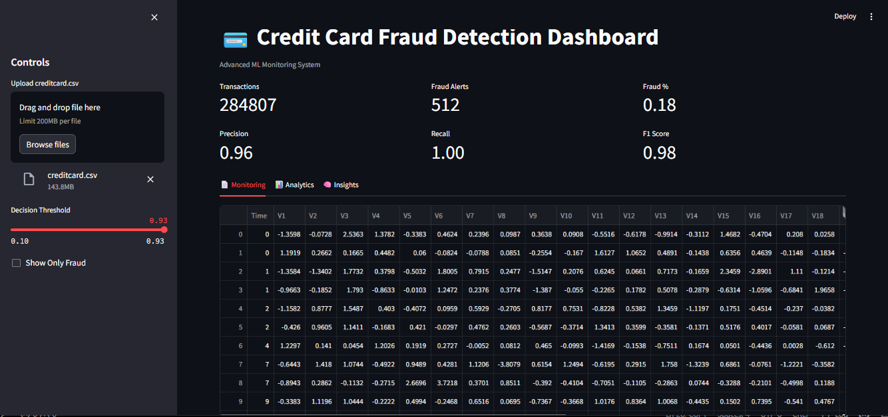
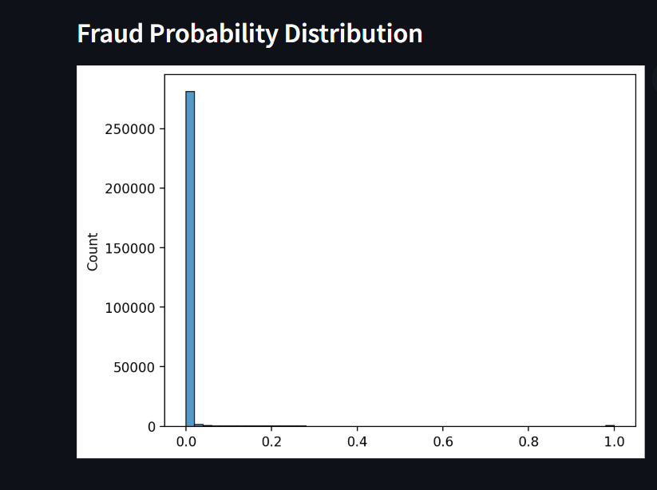
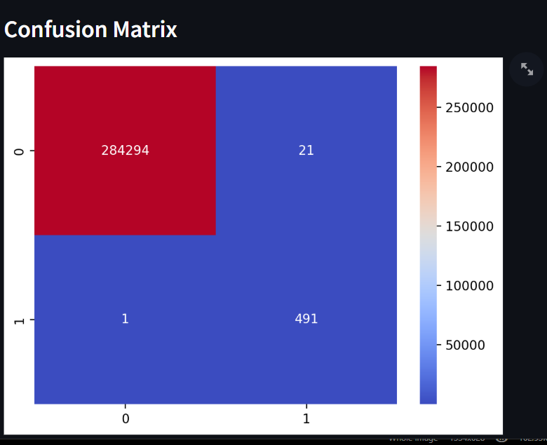
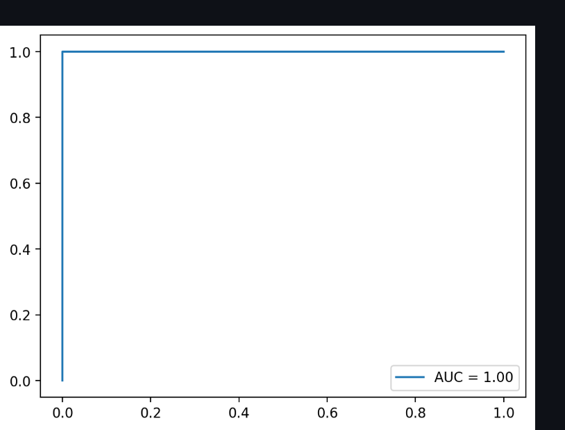
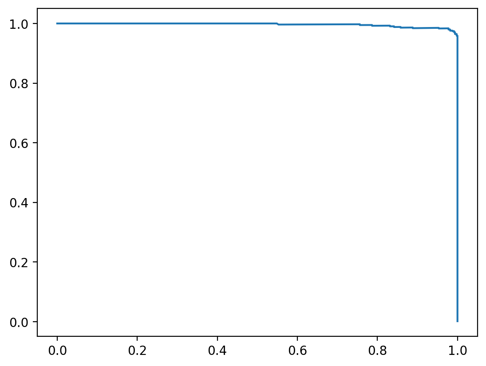
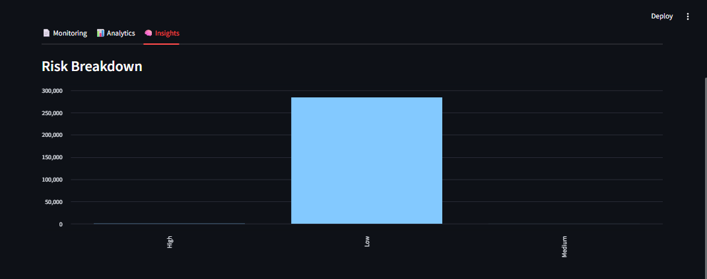
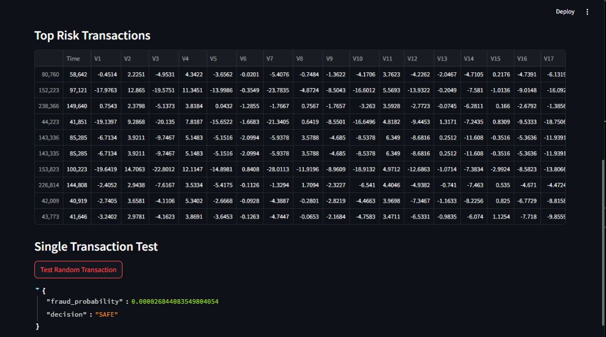

 
# Credit Card Fraud Detection System

## Overview

This project is an end-to-end Machine Learning system for detecting fraudulent credit card transactions.
It includes data preprocessing, model training, and an interactive dashboard built using Streamlit for analysis.

## Objectives

* Detect fraudulent transactions with high accuracy
* Provide interactive data analysis via dashboard
* Visualize fraud probability and insights
* Support decision-making using threshold tuning

## Key Features

### Machine Learning Pipeline

* Data preprocessing and feature engineering
* Handling imbalanced data (SMOTE)
* Model training using XGBoost
* Threshold optimization

### Interactive Dashboard (Streamlit)

* Upload dataset and analyze transactions
* KPI metrics (Fraud %, Alerts, Transactions)
* Fraud distribution visualization
* Probability-based risk filtering
* Search and filter transactions
* Export results as CSV

## Dashboard Overview

  

## Fraud Detection Insights

  

## Model Performance

  

  

  

### Risk Breakdown

  

## High Risk Transactions

  

## Project Structure

CREDIT-CARD-FRAUD-DETECTION/
│
├── dashboard/
│   └── app.py
│
├── data/
│   └── creditcard.csv
│
├── images/                    
│   ├── dashboard.png
│   ├── fraud-detection.png
│   ├── confusion-matrix.png
│   ├── risk-breakdown-chart.png
│   ├── top-risk-transactions-dashboard.png
│   ├── roc-curve-dashboard.png
│   └── Precision-recall-curve-dashboard.png
│
├── models/
│
├── outputs/
│   └── app.log
│
├── simulate/
│
├── src/
│   ├── preprocess.py
│   ├── pipeline.py
│   ├── train.py
│   ├── evaluate.py
│   └── explain.py
│
├── venv/
├── main.py
└── README.md

## Installation

1. Clone the repository

git clone https://github.com/Nikhatjahan85/credit-card-fraud-detection.git
cd credit-card-fraud-detection

2. Create virtual environment

python -m venv venv

Activate environment:

venv\Scripts\activate

3. Install dependencies

pip install -r requirements.txt

4.Dataset

Download the dataset from Kaggle and place it inside:

## How to Run

## Train Model

python main.py

## Select:

1 → Train Model

2 -Run Dashboard

streamlit run dashboard/app.py

3 - View Logs

4- Exit

## Model Performance

* Precision: High
* Recall: High
* F1 Score: Balanced

## Business Value

- Reduces fraud losses
- Enables real-time monitoring
- Supports decision-making via threshold tuning
- Simulates real fintech risk system

## Tech Stack

* Python
* Scikit-learn
* XGBoost
* Pandas, NumPy
* Streamlit
* Plotly

## Future Improvements

* User authentication
* Cloud deployment
* Model explainability (SHAP)
* Real-time streaming integration
* Database integration

## Author

Nikhat Jahan

GitHub: https://github.com/Nikhatjahan85

